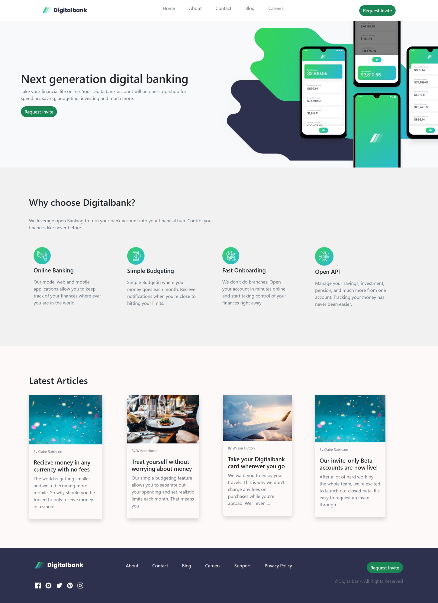

# Atomic Web Design with React & Bootstrap

This project implements the **core concepts of Atomic Web Design** using **React** and **Bootstrap**.  
The purpose of this task was to understand how to structure components in an **Atomic Design hierarchy** and to practice creating reusable UI elements with **Bootstrap styling**.

---

## 📚 Learning Objective

- Understand and apply **Atomic Design methodology**:
  - **Atoms** → Smallest UI building blocks (buttons, titles, images, labels, etc.)
  - **Molecules** → Combinations of atoms (form fields, nav lists, etc.)
  - **Organisms** → Complex UI sections built from molecules & atoms (headers, cards, sections)
  - **Templates** → Page layouts containing organisms
  - **Pages** → Final, fully functional screens

- Build a **React project** that uses this structure.
- Style components using **Bootstrap** for responsiveness and a professional UI.

---

## 🛠 Tech Stack

- **React** (Frontend framework)
- **Bootstrap** (UI styling & layout)
- **TypeScript** (type safety)
- **Atomic Design Pattern** (component structure)

---

## 🚀 Features Implemented

- Modular component structure following **Atomic Design**
- Reusable **atoms** such as `CardTitle`, `Description`, and `Button`
- Organized **molecules** such as `HeaderNavList`, `HighLightCard`
- Full **organisms** like `Header`, `Footer`, and `HighlightCards`
- Centralized **asset management** for all images/icons
- Attractive design with Bootstrap

---

## 📸 Project Screenshot

