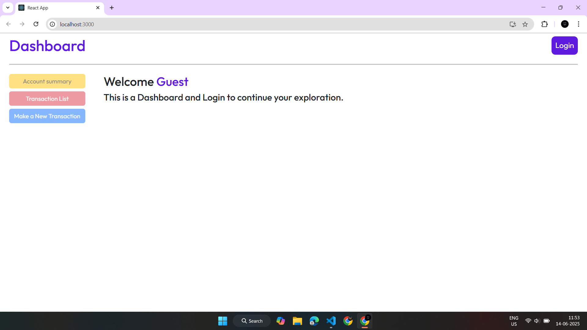
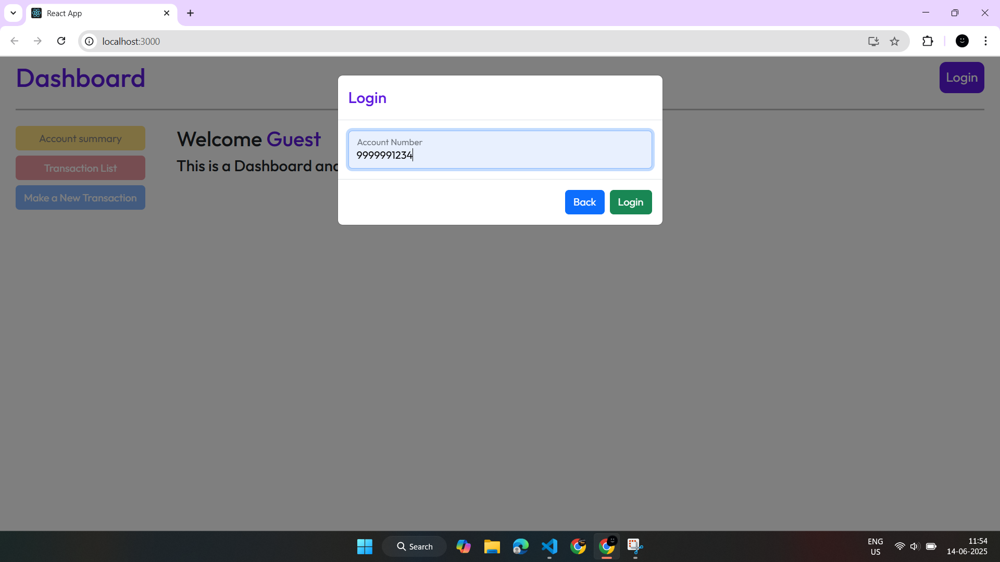
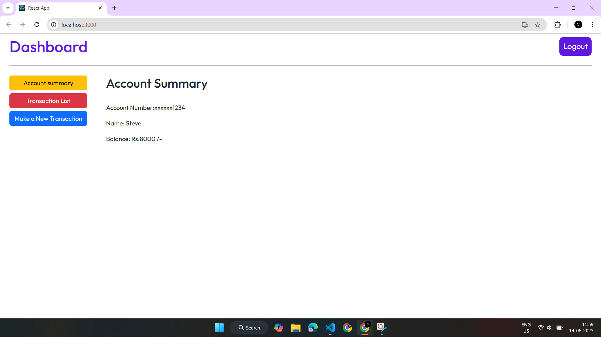
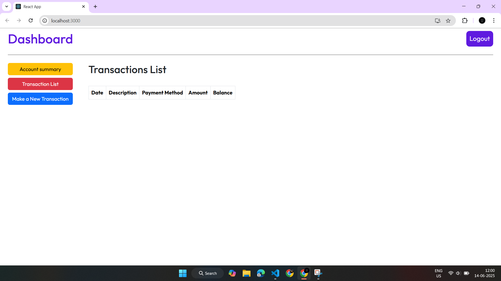
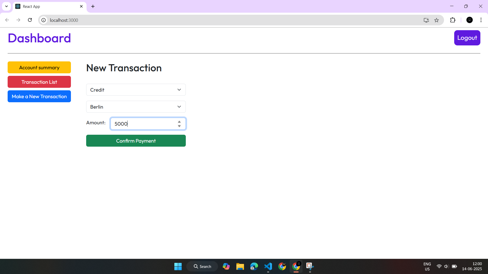
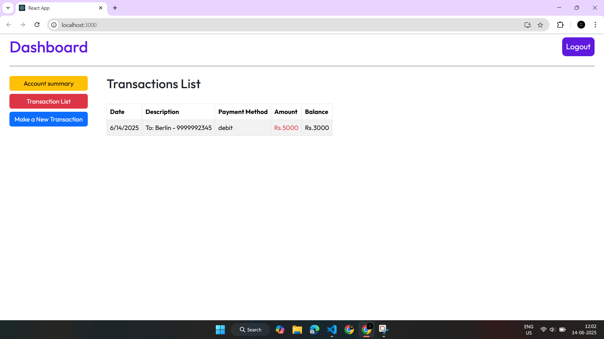
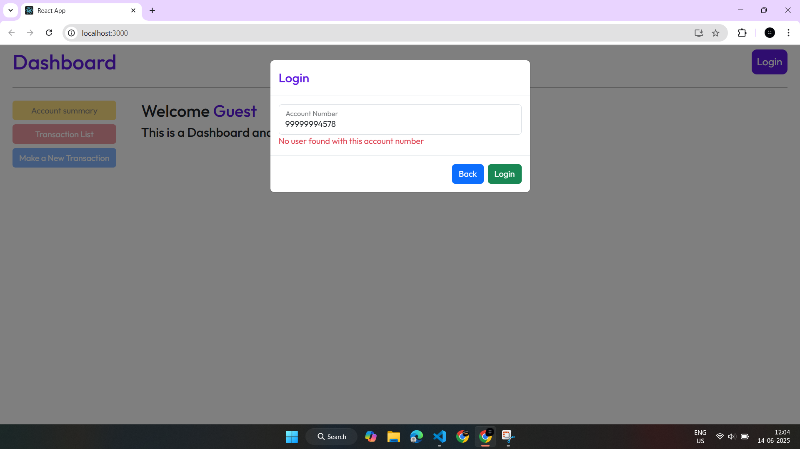
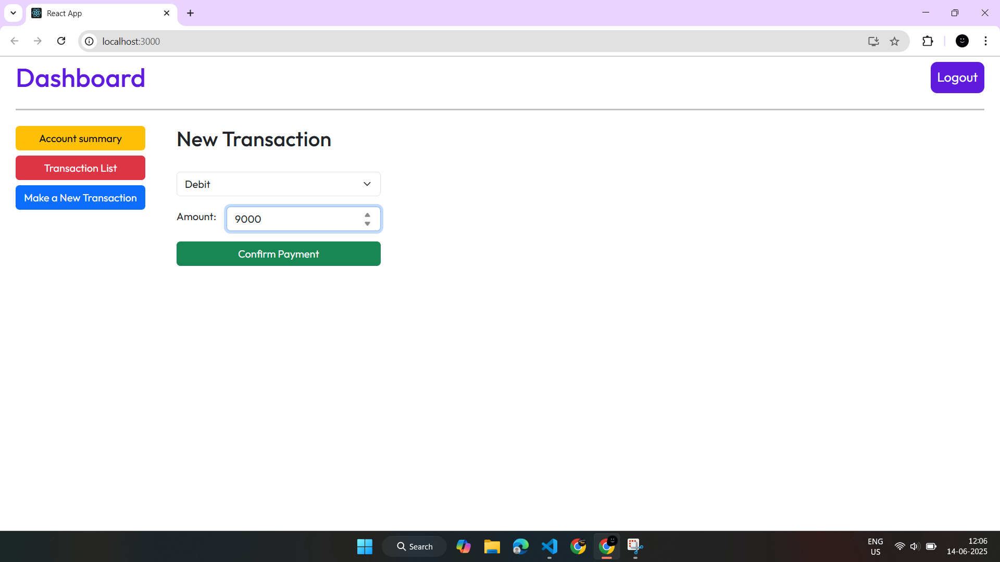
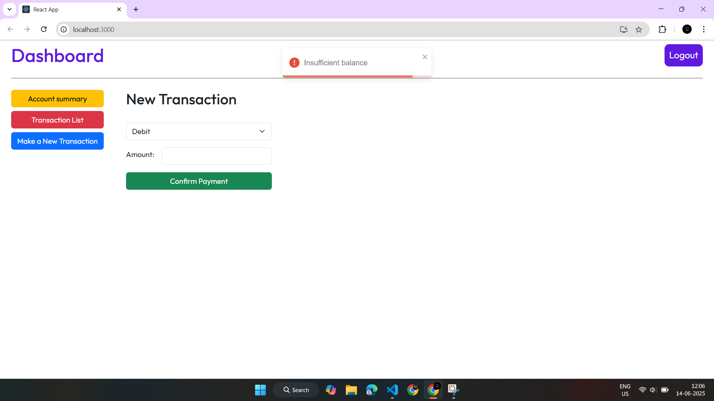

# 🏦 React Banking Dashboard Application

This is a responsive **Banking Dashboard** application built using **React** and **React-Bootstrap**. It allows users to log in, view account summaries, see transaction history, and make new transactions — all from a single, dynamic dashboard interface.

---

## 🚀 Features

- 🔐 **User Login / Logout** system
- 📄 **Account Summary** with masked account number and current balance
- 📜 **Transaction List** display (component integrated via module)
- 💰 **New Transaction** entry functionality (component integrated via module)
- 🧭 **Navigation Buttons** to switch views dynamically within the dashboard
- ✅ **Login State Control**: Buttons are disabled until the user logs in
- 🎉 **Toast Notifications** for user feedback (login,logout,payment confirmation)

---

## 📦 Components Overview

### Dashboard
Main layout that manages user navigation and login state. Includes:
- Top navigation with Login/Logout button
- Buttons to switch between views: Account Summary, Transaction List, New Transaction
- Conditional rendering of content based on selected menu
- Uses `TransactionContext` for shared state

### AccountSummary
Displays logged-in user's details:
- Masked Account Number: e.g., `xxxxxx1234`
- Name
- Total Balance
Fetches data using `findCustomerByAccountNumber` from context.

### TransactionList
Referenced in code (not uploaded), likely displays:
- Transaction type (credit/debit)
- Amount
- Description and timestamp

### NewTransaction
Referenced in code (not uploaded), likely includes:
- Input fields for amount, recipient, type
- Submission to update transaction context or state

### LoginForm
A modal that allows users to log in. Triggered when the **Login** button is clicked and `isLoggedIn` is false. Upon successful login, it updates the `currentUser` in context and closes the modal.

## 🛠 Technologies Used

- React
- React-Bootstrap
- React Context API
- Toastify (for notifications)

---

## 📸 UI Preview

### Dashboard Before Login

### Login Form

### Dashboard After Login

### Account Summary Page

### Inital Transaction Page

### New Transaction Page

### Transactin Successful 

### After Transaction Page

### Recivers Transaction page

### Some Validations

> - Dashboard before login
> - Login modal
> - Account Summary view
> - Disabled buttons before login

---

## ▶️ How It Works

1. The user opens the Dashboard.
2. If not logged in, the user is prompted to log in via a modal.
3. Once logged in:
   - User details are stored in context.
   - Navigation buttons become enabled.
4. The user can now:
   - View account details
   - See previous transactions
   - Make a new transaction
5. User can click **Logout**, which:
   - Resets view to home
   - Shows a toast confirming logout

