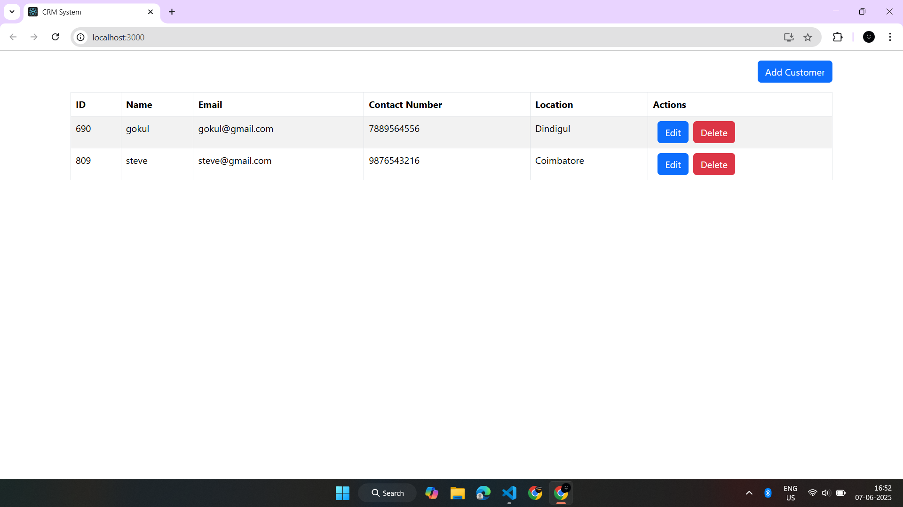
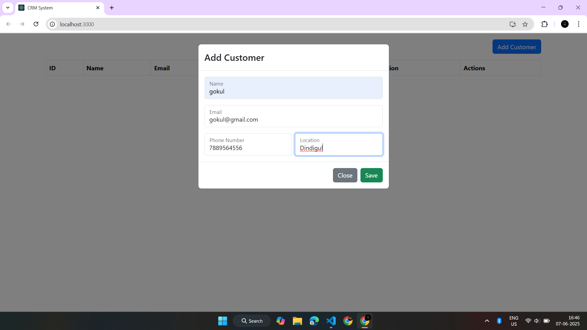
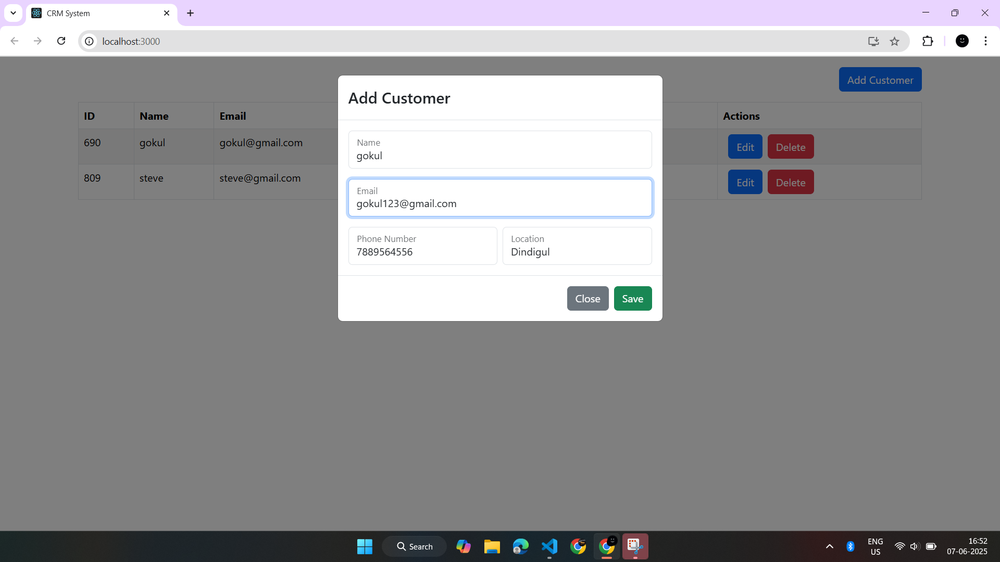
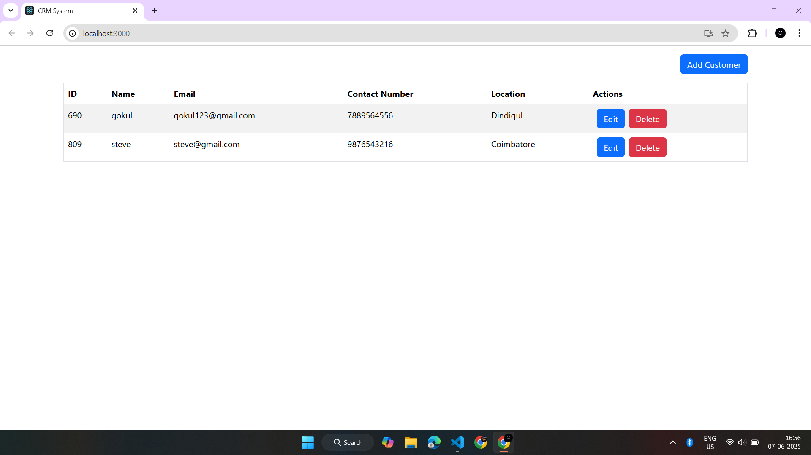

# 🧾 React CRM System Application

A simple and interactive **Customer Relationship Management (CRM)** system built using **React** and **React-Bootstrap**. This application enables you to add, edit, and delete customer records while maintaining a responsive and clean user interface.

---

## 📌 Features

- ✅ **Add New Customers** – Enter name, email, phone number, and location.
- ✏️ **Edit Existing Customers** – Update customer details from the table.
- ❌ **Delete Customers** – Remove customers from the list.
- 📋 **Tabular Display** – View all customers in a responsive table.
- 🆔 **Auto ID Generation** – Random ID assigned to new customers.
- 📦 **Modular Components** – Clean and reusable component-based architecture.
- 💅 **Styled UI** – Built using React-Bootstrap components for better UX.

---

## 🧱 Tech Stack

- **React** – JavaScript UI library
- **React-Bootstrap** – UI component styling
- **JavaScript (ES6+)**

---

## 🖼️ Application Screenshots

### 📄 Customer Table View

### ➕ Add Customer Modal

### ✏️ Edit Customer Modal

### ✅ Table After Editing

### ❌ Table After Deleting a Customer
